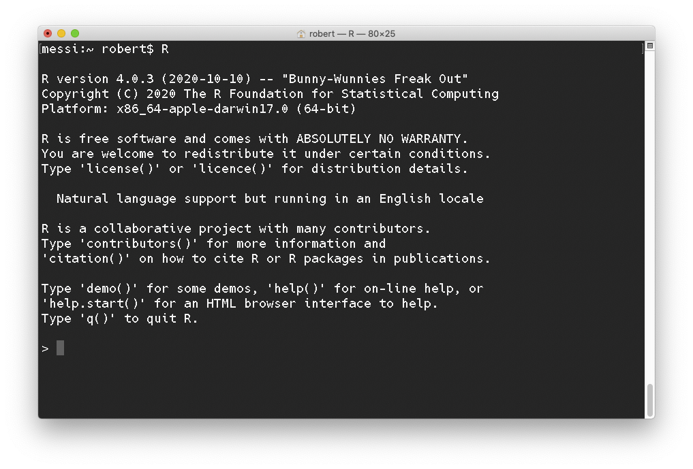
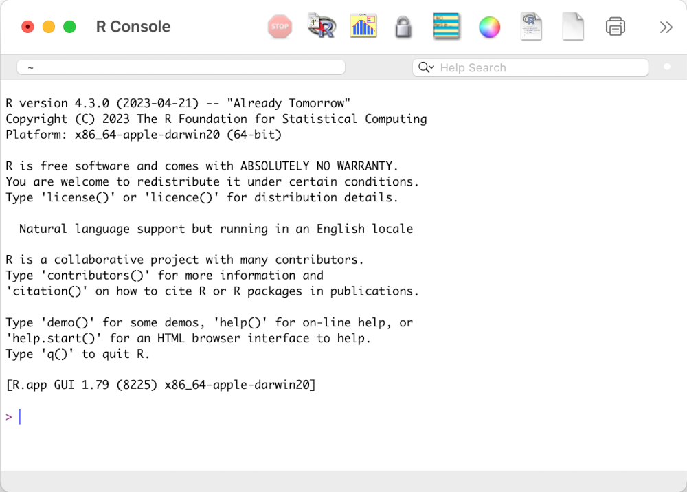
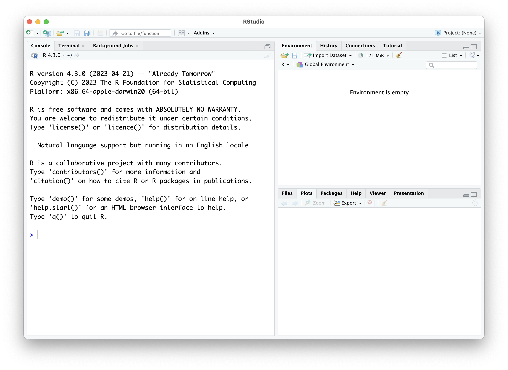
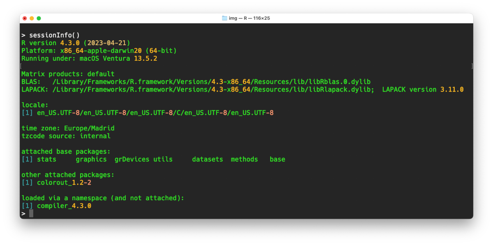
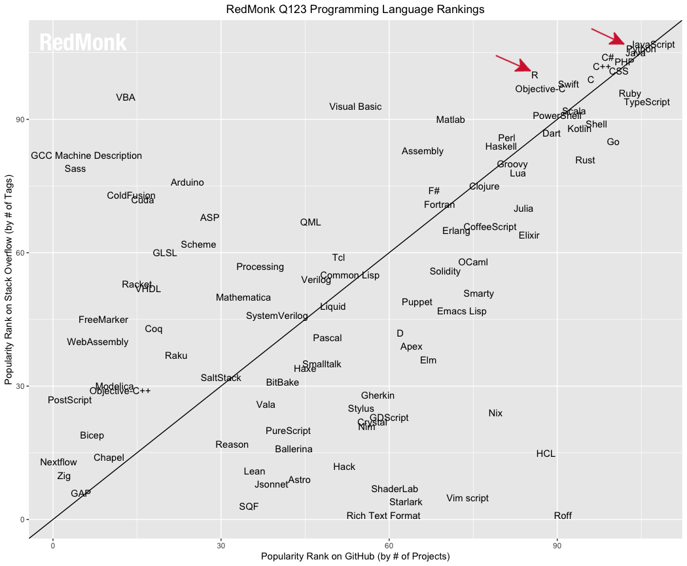
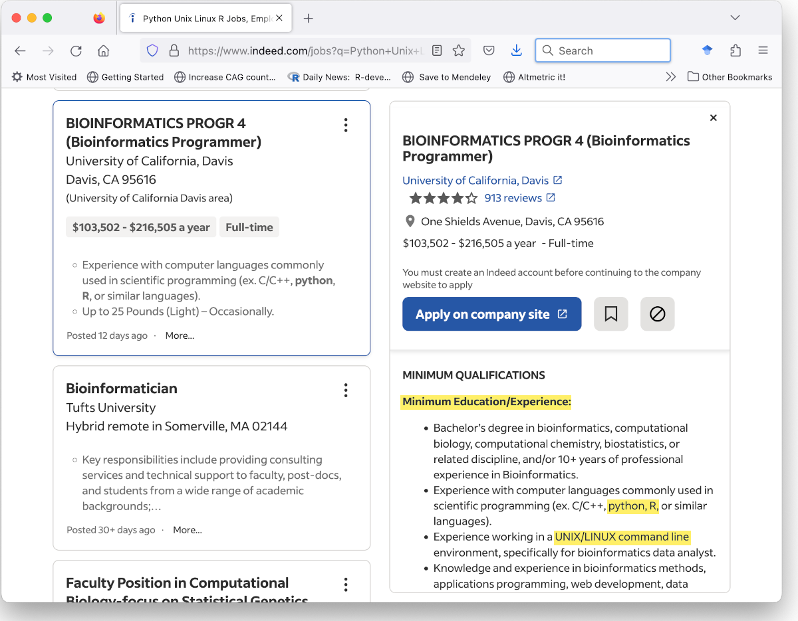

```{r setup, include=FALSE, cache=FALSE}
options(htmltools.dir.version = FALSE, width=80)
knitr::opts_chunk$set(warning = FALSE, message = FALSE, cache=TRUE)

## from http://yihui.name/knitr/hooks#chunk_hooks
knitr::knit_hooks$set(small.mar=function(before, options, envir) {
                                              if (before) par(mar=c(4, 5, 1, 1)) ## smaller margin on top and right
})
```

class: title-slide, middle, center

# Programming with data: the R language

## Robert Castelo
[robert.castelo@upf.edu](mailto:robert.castelo@upf.edu)
### Dept. of Medicine and Life Sciences
### Universitat Pompeu Fabra

<br>

## Fundamentals of Computational Biology
### BSc on Human Biology
### UPF School of Health and Life Sciences
### Academic Year 2023-2024

---
class: center, middle, inverse

# R project and R packages

---

## The R project

* The R project at [http://www.r-project.org](http://www.r-project.org) is an
  open-source community effort to develop a free software environment, called R,
  for statistical computing and graphics.  
  &nbsp;&nbsp;
--

* R is also a [programming language](http://en.wikipedia.org/wiki/R_%28programming_language%29)
  and currently the _lingua franca_ for statistical research and data analysis.  
  &nbsp;&nbsp;
--

* It was started in 1993 by the statisticians
  [Ross Ihaka](http://en.wikipedia.org/wiki/Ross_Ihaka)
  and [Robert Gentleman](http://en.wikipedia.org/wiki/Robert_Gentleman_%28statistician%29)
  and has become extremely popular in both academy and industry with an estimated
  users base of one million people worldwide; see
  [this](https://www.nytimes.com/2009/01/07/technology/business-computing/07program.html)
  2009 article about R in the New York Times.  
  &nbsp;&nbsp;
--

* The R software can be freely downloaded and installed in Linux, Windows and
  Mac computers from [http://cran.r-project.org](http://cran.r-project.org).  
  &nbsp;&nbsp;
--

* A new stable version is released every year on April and development versions
  are updated on a daily basis. The last major release (version 4.3.0) took
  place on April, 2023.

---

## Running R in the command line

* You can run R on the terminal window by typing `R` on the Unix shell.



---

## Running R in its default GUI

* You can run R using the default graphical user interface (GUI). 



---

## Running R in RStudio

* You can run R using the [RStudio](https://rstudio.com) application.



---

## R packages

* The R functionality is implemented through a number of software add-on
  [_packages_](https://en.wikipedia.org/wiki/R_package), which divide R
  in two conceptual parts:
  1. The "base" R system with a handful of pre-installed packages.
  2. Everything else: packages written by others or by ourselves.
* To use a package one needs to:
  1. Install the package, just once.
  2. Load the package with the function call `library()`.
* There are thousands of packages contributed by the community and freely
  available.  
  &nbsp;&nbsp;
* Packages are one of the keys in the success of R, because they are often
  written by the experts who developed the undelying methodology.

---

## R packages

* R Packages can be downloaded and installed from repositories such as
  1. The Comprehensive R Archive Network (CRAN) at [https://cran.r-project.org](http://cran.r-project.org)
  2. The Bioconductor project at [https://bioconductor.org](https://bioconductor.org)
  3. GitHub at [https://github.com](https://github.com)
* CRAN and Bioconductor can be considered _trusted_ repositories, because
  they provide some minimum standards of
  [versioning](https://en.wikipedia.org/wiki/Software_versioning),
  [archiving](https://en.wikipedia.org/wiki/Legacy_system),
  [licensing](https://en.wikipedia.org/wiki/Software_license)
  and
  [testing](https://en.wikipedia.org/wiki/Software_testing).  
  &nbsp;&nbsp;
* Relying on a package from an _untrusted_ repository, such as a GitHub repo
  from any given developer, has the potential pitfall that it may dissapear
  from one day to the next.

---

## R packages

* R GUIs provide point-and-click interfaces to install packages from trusted
  repositories.  
  &nbsp;&nbsp;
* The most commonly reported way to install package is by giving the
  corresponding instruction in the R shell.
  * For [CRAN](https://cran.r-project.org), e.g., package
    [Seurat](https://cran.r-project.org/package=Seurat):
    <pre>
    > install.packages("Seurat")
    </pre>
  * For [Bioconductor](https://bioconductor.org), e.g., package [GenomicScores](https://bioconductor.org/packages/GenomicScores):
    <pre>
    > library(BiocManager) ## install first 'BiocManager' from CRAN
    > install("GenomicScores")
    </pre>
  * For [GitHub](https://github.com), e.g., package [covid-19-data](https://github.com/nytimes/covid-19-data)
    from the [New York Times](https://github.com/nytimes):
    <pre>
    > library(remotes) ## install first 'remotes' from CRAN
    > install_github("nytimes/covid-19-data")
    </pre>

---

## Session information

* To facilitate reproducing results or reporting errors, it is necessary to
  know the specific versions of R and the packages involved in a given data
  analysis.  
  &nbsp;&nbsp;
* The function `sessionInfo()` reports versions of R and currently loaded and
  attached packages:
  

---

## Concluding remarks (R project and R packages)

* The R project provides one of the most popular free and open-source platforms for
  analysing data.  
  &nbsp;&nbsp;
* R packages provide a modular and flexible way to extend R's functionality.  
  &nbsp;&nbsp;
* The installation of most R packages is straightforward, however, one should
  pay attention to whether the installed package is available in a trusted
  repository.  
  &nbsp;&nbsp;
* R and its packages are under continuous development. To facilitate error
  reporting and reproducibility we should keep track of the R and package
  versions being used.

---
class: center, middle, inverse

# The R language

---

## The R language

* The [R programming language](https://en.wikipedia.org/wiki/R_%28programming_language%29)
  is the language of the R software and is an evolving implementation of the
  former [S programming language](https://en.wikipedia.org/wiki/S_%28programming_language%29),
  developed primarly by
  [John Chambers](https://en.wikipedia.org/wiki/John_Chambers_%28statistician%29),
  Richard Becker and Allan Wilks at Bell Laboratories in the 70s.  
  &nbsp;&nbsp;
* The initial goal of the S and R languages was to offer an interactive approach
  to statistical computing, instead of having to run calculations in batch. If
  you want to learn more about the history of R, you may consult
  [this article]( https://doi.org/10.1111/j.1740-9713.2018.01169.x) by Nick
  Thieme.  
  &nbsp;&nbsp;
* The R language is a [functional programming language](https://en.wikipedia.org/wiki/Functional_programming)
  tailor-made for analysing data with features such as taking mathematical
  expressions as input to functions.  
  &nbsp;&nbsp;
* The R project provides technical documentation in the form of a number of
  [reference manuals](https://cran.r-project.org/manuals.html), including one for
  the [R language](https://cran.r-project.org/doc/manuals/r-release/R-lang.html).

---
class: small-table

## Operators

* Arithmetic operators:

|   Operator           |  Example  |  Result |
|--------------------- | :-------: | :-----: |
| addition             |   2 + 2   |    4    |
| subtraction          |   3 - 2   |    1    |
| multiplication       |   3 * 2   |    6    |
| division (quotient)  |   6 / 3   |    2    |
| division (remainder) |   6 %% 4  |    2    |

* Comparison operators:

|    Description        |  Operator |
|---------------------- | :-------: |
|     equality          |    ==     |
|    inequality         |    !=     |
|    greater than       |    >      |
|    smaller than       |    <      |
| greater or equal than |    >=     |
| smaller or equal than |    <=     |

---

## Basic (atomic) data types

* There are [six basic data types](https://cran.r-project.org/doc/manuals/r-release/R-lang.html#Vector-objects) 
in R, sometimes referred to as _atomic_, from which we highlight the following four:
  * _logical_: `TRUE`, `FALSE`
  * _integer_: `1, 2, 3, 4, ..`
  * _double_: `1.1, 2.3, 3.1416, ..`
  * _character_: `"A", "B", "C", "Hello World!", ..`
* The function `typeof()` provides the data type:
  <pre>
  > typeof(TRUE)
  "logical"
  </pre>
* Unless specified, numbers are _doubles_ by default. 
  <pre>
  > typeof(1)
  [1] "double"
  > typeof(1L)
  [1] "integer"
  </pre>

---

## Object classes

* Objects in R may belong to one or more
  [classes](https://cran.r-project.org/doc/manuals/r-release/R-lang.html#Classes),
  which may coincide, or not, with the data type and which we can find out with the
  function `class()`:
  <pre>
  > class(TRUE)
  "logical"
  </pre>
* Object classes are part of the so-called
  [object-oriented programming (OOP)](https://en.wikipedia.org/wiki/Object-oriented_programming)
  paradigm, which R offers in three flavors:
  * S3: interactive, simple and lightweight.
  * S4: formal and rigorous.
  * RC: reference classes, departing from the functional programming model of
    S3 and S4, it enforces function methods to be encapsulated within the class
    definition.
* While OOP with R is not the focus of this course, you may consult the
  [OOP chapter](https://adv-r.hadley.nz/oo.html) from the book
  ["Advanced R"](https://adv-r.hadley.nz) by [Hadley Wickham](http://hadley.nz)
  if you are interested.

---

## Assignments and the workspace

* We can create objects and assign values to those objects by using the `<-`
  assignment operator:
  <pre>
  > x <- 1
  > x
  [1] 1
  </pre>
* Although you can also use the `=` operator to do an assignment, it is better
  to reserve it to specify argument values in function calls.  
  &nbsp;&nbsp;
* To see the objects created in an R session, also known as _workspace_, use
  the function `ls()`:
  <pre>
  > ls()
  [1] "x"
  </pre>
* To remove an object from the workspace, use the function `rm()`:
  <pre>
  > rm(x)
  </pre>

---

## Vectors

* One of the most basic classes of objects in R are (atomic) _vectors_, which 
can store only one data type. Single values are also considered vectors of length 1.  
  &nbsp;&nbsp;
* Vectors of numbers can be created in a number of different ways:
  * Using the `c()` _combination_ function:
    <pre>
    > c(10, 2, 4, 5, 20, -1)
    [1] 10  2  4  5 20 -1
    </pre>
  * Using a _range_
    (a [closed interval](https://en.wikipedia.org/wiki/Interval_%28mathematics%29))
    with the colon `:` notation:
    <pre>
    > 2:7
    [1] 2 3 4 5 6 7
    </pre>
  * Using the `seq()` family of functions to generate regular sequences:
    <pre>
    > seq(2, 7 ,2)
    [1] 2 4 6
    </pre>

---

## Vectors

* Logical vectors can be expressed using `T` and `F` as shorthands for `TRUE`
  and `FALSE`:
  <pre>
  > c(T, F, T, F, T, F, T, F)
  [1]  TRUE FALSE  TRUE FALSE  TRUE FALSE  TRUE FALSE
  </pre>
* Vectors of character literals are written using double quotes around their values.
  <pre>
  > c("A", "C", "G", "T", "T", "G", "A", "G")
  [1] "A" "C" "G" "T" "T" "G" "A" "G"
  </pre>

---

## Vectors

* Vector positions in R are 1-based, this means, .boldface[they start at position 1].
  The function `length()` provides the number of elements of the vector.
  <pre>
  > v <- 1:3
  > length(v)
  [1] 3
  </pre>
* To access a single element of a vector we use a bracket notation as follows:
  <pre>
  > v[1]
  [1] 1
  </pre>
* Vectors in R also allow to name positions and access values by name:
  <pre>
  > names(v) <- c("A", "B", "C")
  > v
  A B C
  1 2 3
  > v["B"]
  B
  2
  </pre>

---

## Encoding vectors as factors

* [Factors](https://cran.r-project.org/doc/manuals/r-release/R-lang.html#Factors) 
are a special class of vectors used to categorize data and store its levels. 
They are specially useful when the vector contains a limited number of unique 
values, technically called .boldface[levels] in this context.
  <pre>
  > sex <- c("female", "male", "male", "female", "female")
  > sex_factor <- factor(sex)
  > sex_factor
  [1] female male   male   female female
  Levels: female male
  </pre>
* Levels are alphabetically ordered by default, but that order can be modified
  using the `levels` argument in the call to `factor()`:
  <pre>
  > sex_factor <- factor(sex, levels=c("male", "female"))
  > sex_factor
  [1] female male   male   female female
  Levels: male female
  </pre>

---

## Encoding vectors as factors

* Elements inside a factor can be accessed using the same bracket notation as
  vectors: 
  <pre>
  > sex_factor[3]
  [1] male
  Levels: male female
  </pre>
* Levels can be retrieved using the `level()` function.
  <pre>
  > levels(sex_factor)
  [1] "male"   "female"
  </pre>
* Importantly, a factor can be converted into a _numeric_ vector
  of integer values, according to the order of its levels.
  <pre>
  > sex_factor
  [1] female male   male   female female
  Levels: male female
  > as.numeric(sex_factor)
  [1] 2 1 1 2 2
  </pre>
  
---

## Matrices

* Matrices can be created with the function `matrix()` from a vector, filling
  cells by columns, as follows:
  <pre>
  > m <- matrix(1:9, nrow=3)
  > m
       [,1] [,2] [,3]
  [1,]    1    4    7
  [2,]    2    5    8
  [3,]    3    6    9
  </pre>
* Matrices, like vectors, can store only one single data type.
  <pre>
  > typeof(m)
  [1] "integer"
  > class(m)
  [1] "matrix" "array"
  </pre>
* Matrices have dimensions and we can access their elements with `m[i, j]`.
  <pre>
  > dim(m)
  [1] 3 3
  </pre>
  
---

## Lists

* A [list](https://cran.r-project.org/doc/manuals/r-release/R-lang.html#List-objects)
  object is a vector that may contain elements of different type and they are
  created with the function `list()` as follows:
  <pre>
  > l <- list(1, TRUE, "World")
  > l
  [[1]]
  [1] 1  
  &nbsp;&nbsp;
  [[2]]
  [1] TRUE  
  &nbsp;&nbsp;
  [[3]]
  [1] "World"
  > length(l)
  [1] 3
  </pre>

---

## Lists

* List objects typically have named elements, which we can give with the
  function `name()` or at creation time:
  <pre>
  > l <- list(gene="GAPDH", organism="H.sapiens", chromosome=12)
  > l
  $gene
  [1] "GAPDH"
  &nbsp;&nbsp;
  $organism
  [1] "H.sapiens"
  &nbsp;&nbsp;
  $chromosome
  [1] 12
  </pre>

---

## Lists: accessing elements

* To access an element of the list we can use either the double-bracket operator
  `[[` with a valid index position or, if the list elements has names, the
  element's name. If the name is made out of letters and numbers only, you can
  also use the dollar `$` operator. These are all equivalent ways of doing the
  same job:
  <pre>
  > l[[1]]
  [1] "GAPDH"
  > l[["gene"]]
  [1] "GAPDH"
  > l$gene
  [1] "GAPDH"
  </pre>

---

## Lists: adding elements

* To add an element to an existing list, you only need to do an assignment on
  that new element, for instance:
  <pre>
  > l$position <- 6534517
  > l
  $gene
  [1] "GAPDH"
  &nbsp;&nbsp;
  $organism
  [1] "H.sapiens"
  &nbsp;&nbsp;
  $chromosome
  [1] 12
  &nbsp;&nbsp;
  $position
  [1] 6534517
  </pre>

---

## Data frames

* Data frame objects are like matrices, but different columns may store
  different types of values. We can create a `data.frame` object as follows:
  <pre>
  > df <- data.frame(gene=c("GAPDH", "FOXP2"),
                       organism=c("H.sapiens", "R.norvegicus"),
                       chromosome=c(12, 2),
                       row.names=c("P04406", "P0CF24"))
  > df
            gene     organism chromosome
  P04406 GAPDH    H.sapiens         12
  P0CF24 FOXP2 R.norvegicus          2
  > dim(d)
  [1] 2 3
  > rownames(df)
  [1] "P04406" "P0CF24"
  </pre>
* However, most of the times, we will obtain a `data.frame` object as a
  result of a call to the function `read.csv()`, which allows one to read
  [CSV](https://en.wikipedia.org/wiki/Comma-separated_values) files.

---

## Data frames: accessing rows

* The bracket operator `[` can be used to access rows by setting indices,
  or row names, in the **first** of the two dimensions, separated by a
  comma:
  <pre>
  > df[2, ]
            gene     organism chromosome
  P0CF24 FOXP2 R.norvegicus          2
  > df["P0CF24", ]
            gene     organism chromosome
  P0CF24 FOXP2 R.norvegicus          2
  </pre>
* Note that accessing a whole row always gives a `data.frame` object as
  a result:
  <pre>
  class(df[2, ])
  [1] "data.frame"
  </pre>

---

## Data frames: accessing columns

* The bracket operator `[` can be used to access columns by setting indices,
  or column names, in the **second** of the two dimensions, separated by a
  comma:
  <pre>
  > df[, 2]
  [1] "H.sapiens"    "R.norvegicus"
  > df[, "organism"]
  [1] "H.sapiens"    "R.norvegicus"
  </pre>
* Additionally, we can also directly access the column of a `data.frame` object
  as if it were an element of a `list`, using the `$` operator:
  <pre>
  > df$organism
  [1] "H.sapiens"    "R.norvegicus"
  </pre>
* Differently to accessing whole rows, accessing whole columns always gives a
  vector (of the corresponding data type) as a result:
  <pre>
  class(df[, 2])
  [1] "character"
  </pre>

---

## Data frames: adding columns

* You can add a column to an existing `data.frame` object in a similar way
  in which you add an element to a list, for instance:
  <pre>
  > df$position <- c(6534517, 43133827)
  > df
          gene     organism chromosome position
  P04406 GAPDH    H.sapiens         12  6534517
  P0CF24 FOXP2 R.norvegicus          2 43133827
  </pre>
* If the column name contains other characters than letters numbers, such
  as for instance space characters, you cannot use the `$` operator, but
  you can use the double bracket `[[` operator in the previous assignment.

---

## Concluding remarks (Data types and indexing)

* Vectors are the primary class of objects in R, whose elements can be accessed
  through 1-based position indexing as well as by naming indexing.  
  &nbsp;&nbsp;
* Vectors and matrices store a single data type in an object.  
  &nbsp;&nbsp;
* Lists are like vectors but can store different data types in the same object.
  They can also store objects of any class in their elements.  
  &nbsp;&nbsp;
* Data frames are rectangular objects like matrices, with rows and columns, but
  different columns can store different data types.

---
class: center, middle, inverse

# Subsetting

---

## Subsetting

* Subsetting refers to extract parts of an object. This is done using vectors,
  for instance:
  <pre>
  > v <- seq(10, 100, by=10)
  > v
  [1]  10  20  30  40  50  60  70  80  90 100
  > v[1:5]
  [1] 10 20 30 40 50
  </pre>
* A powerful approach to subsetting is by using logical vectors.
  <pre>
  > mask <- v > 50
  > mask
  [1] FALSE FALSE FALSE FALSE FALSE  TRUE  TRUE  TRUE  TRUE  TRUE
  > v[mask]
  [1] 60  70  80  90 100
  </pre>

---

## Subsetting: matrices

* We can subset rows or columns of matrices:
  <pre>
  > m <- matrix(1:9, nrow=3)
       [,1] [,2] [,3]
  [1,]    1    4    7
  [2,]    2    5    8
  [3,]    3    6    9
  > m[1:2, ]
       [,1] [,2] [,3]
  [1,]    1    4    7
  [2,]    2    5    8
  > m[, 2:3]
         [,1] [,2]
  [1,]    4    7
  [2,]    5    8
  [3,]    6    9
  </pre>

---

## Subsetting: lists

* We can subset a list using the bracket operator `[`.
  <pre>
  > l <- list(gene="ACE2", UniProt="Q9BYF1",
                 PubMedIDs=c("27217402", "11815627", "19021774"))
  > l
  $gene
  [1] "ACE2"
  $UniProt
  [1] "Q9BYF1"
  $PubMedIDs
  [1] "27217402" "11815627" "19021774"
  > l[c(1, 3)]
  $gene
  [1] "ACE2"
  $PubMedIDs
  [1] "27217402" "11815627" "19021774"
  </pre>

---

## Subsetting: data frames

* We can subset a `data.frame` object using the bracket operator `[`.
  <pre>
  > df[2, ]
            gene     organism chromosome
  P0CF24 FOXP2 R.norvegicus          2
  > df[, c("gene", "organism")]
            gene     organism
  P04406 GAPDH    H.sapiens
  P0CF24 FOXP2 R.norvegicus
  > df["organism"]
               organism
  P04406    H.sapiens
  P0CF24 R.norvegicus
  > class(df["organism"])
  [1] "data.frame"
  </pre>

---

## Concluding remarks (Subsetting)

* Subsetting is a key operation to stratify data (e.g., subgroups of a
  population, subgroups of patients, etc.).  
  &nbsp;&nbsp;
* Logical vectors are a powerful way to do subsetting.  
  &nbsp;&nbsp;
* The subsetting operation always returns an object of
  the same class as the original object from which you
  _subset_.

---

## Help and learning resources

* The R software provides different functions to access its manual help pages:
  <pre>
  > help(matrix)
  > ? matrix
  > class ? matrix
  > help.search("matrix") ## if you don't now the exact name
  > apropos("matrix") ## if you don't now the exact name
  > find("matrix") ## if you don't now the exact name
  </pre>
* The internet is plenty of learning materials at different levels:
  * Manuals at [CRAN](https://cran.r-project.org/manuals.html), sections
    2 to 5 of
    ["An introduction to R"](https://cran.r-project.org/doc/manuals/r-release/R-intro.html)
    contain the most basic material.
  * The package [swirl](https://swirlstats.com), which allows you to learn
    R interactively from the R console itself.
  * Online courses by
    [Codeacademy](https://www.codecademy.com/learn/learn-r),
    [Coursera](https://www.coursera.org/learn/r-programming),
    [DataCamp](https://www.datacamp.com/courses/free-introduction-to-r),
    [edX](https://www.edx.org/learn/r-programming/harvard-university-data-science-r-basics) or
    [Udemy](https://www.udemy.com/course/r-basics).
  * The online book [R for Data Science](https://r4ds.had.co.nz) by
  [Hadley Wickham](http://hadley.nz).

---

## Concluding remarks

* There is a huge amount of freely available learning material about R on the
  internet.  
  &nbsp;&nbsp;
* The R programming language has become the standard _de facto_ for data
  analysis in multiple disciplines, including biology.

--

.pull-left[

.footnote[
[RedMonk programming language rankings](https://redmonk.com/sogrady/2023/05/16/language-rankings-1-23)
]
]
.pull-right[

.footnote[
[Job offer for a computational biologist](https://www.indeed.com/jobs?q=Python+Unix+Linux+R&from=mobRdr&utm_source=%2Fm%2F&utm_medium=redir&utm_campaign=dt&vjk=998726a0ded4297f)
]
]
