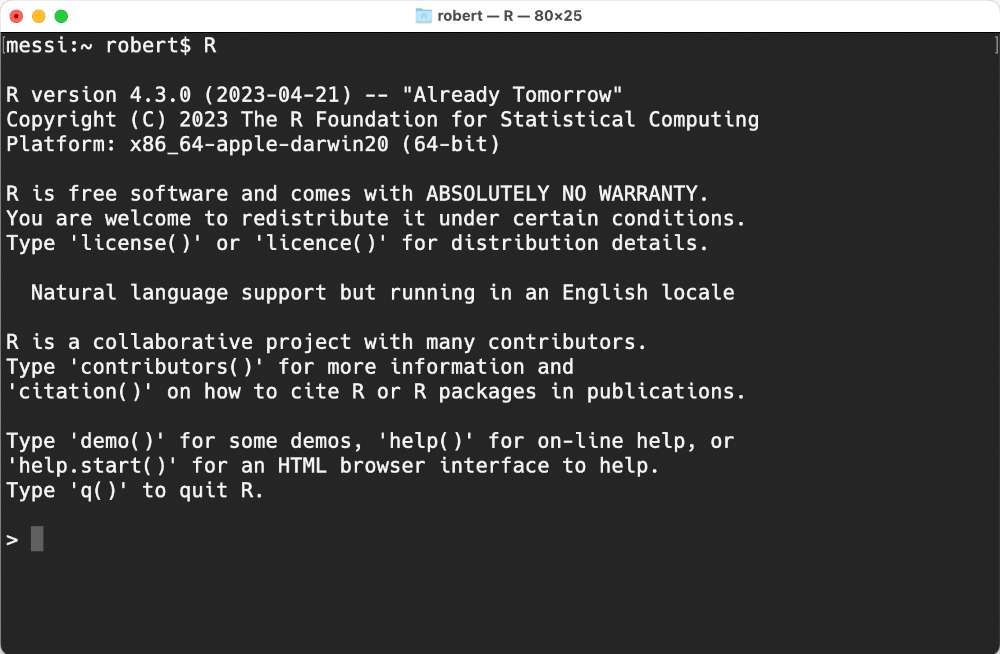

```{r setup, include=FALSE, cache=FALSE}
options(htmltools.dir.version = FALSE, width=80)
knitr::opts_chunk$set(warning = FALSE, message = FALSE, cache=TRUE)

## from http://yihui.name/knitr/hooks#chunk_hooks
knitr::knit_hooks$set(small.mar=function(before, options, envir) {
                                              if (before) par(mar=c(4, 5, 1, 1)) ## smaller margin on top and right
})
```

class: title-slide, middle, center

# Programming with data: the R language

## Robert Castelo
[robert.castelo@upf.edu](mailto:robert.castelo@upf.edu)
### Dept. of Experimental and Health Sciences
### Universitat Pompeu Fabra

<br>

## Fundamentals of Computational Biology
### BSc on Human Biology
### UPF School of Health and Life Sciences
### Academic Year 2021-2022

---

## The R project

* The R project at [http://www.r-project.org](http://www.r-project.org) is an
  open-source community effort to develop a free software environment, called R,
  for statistical computing and graphics.  
  &nbsp;&nbsp;
--

* R is also a [programming language](http://en.wikipedia.org/wiki/R_%28programming_language%29)
  and currently the _lingua franca_ for statistical research and data analysis.  
  &nbsp;&nbsp;
--

* It was started in 1993 by the statisticians
  [Ross Ihaka](http://en.wikipedia.org/wiki/Ross_Ihaka)
  and [Robert Gentleman](http://en.wikipedia.org/wiki/Robert_Gentleman_%28statistician%29)
  and has become extremely popular in both academy and industry with an estimated
  users base of one million people worldwide; see
  [this](https://www.nytimes.com/2009/01/07/technology/business-computing/07program.html)
  2009 article about R in the New York Times.  
  &nbsp;&nbsp;
--

* The R software can be freely downloaded and installed in Linux, Windows and
  Mac computers from [http://cran.r-project.org](http://cran.r-project.org).  
  &nbsp;&nbsp;
--

* A new stable version is released every year about march/april and development
  versions are updated on daily basis. Last major release (version 4.0.0) took
  place on April, 2020.  
  &nbsp;&nbsp;

---

## Running R in the command line

* You can run R on the terminal window by typing `R` on the Unix shell.



---

## Running R in its default GUI

* You can run R using the default graphical user interface (GUI). 


---

## Running R in RStudio

* You can run R using the [RStudio](https://rstudio.com) application.


---

## R packages

* The R functionality is implemented through a number of software add-on
  [_packages_](https://en.wikipedia.org/wiki/R_package), which divide R
  in two conceptual parts:
  1. The "base" R system with a handful of pre-installed packages.
  2. Everything else: packages written by others or by ourselves.
* To use a package one needs to:
  1. Install the package, just once.
  2. Load the package with the function call `library()`.
* There are thousands of packages contributed by the community and freely
  available.  
  &nbsp;&nbsp;
* Packages are one of the keys in the success of R, because they are often
  written by the experts who developed the undelying methodology.

---

## R packages

* R Packages can be downloaded and installed from repositories such as
  1. The Comprehensive R Archive Network (CRAN) at [https://cran.r-project.org](http://cran.r-project.org)
  2. The Bioconductor project at [https://bioconductor.org](https://bioconductor.org)
  3. GitHub at [https://github.com](https://github.com)
* CRAN and Bioconductor can be considered _trusted_ repositories, because
  they provide some minimum standards of
  [versioning](https://en.wikipedia.org/wiki/Software_versioning),
  [archiving](https://en.wikipedia.org/wiki/Legacy_system),
  [licensing](https://en.wikipedia.org/wiki/Software_license)
  and
  [testing](https://en.wikipedia.org/wiki/Software_testing).  
  &nbsp;&nbsp;
* Relying on a package from an _untrusted_ repository, such as a GitHub repo
  from any given developer, has the potential pitfall that it may dissapear
  from one day to the next.

---

## R packages

* R GUIs provide point-and-click interfaces to install packages from trusted
  repositories.  
  &nbsp;&nbsp;
* The most commonly reported way to install package is by giving the
  corresponding instruction in the R shell.
  * For [CRAN](https://cran.r-project.org), e.g., package
    [Seurat](https://cran.r-project.org/package=Seurat):
    <pre>
    > install.packages("Seurat")
    </pre>
  * For [Bioconductor](https://bioconductor.org), e.g., package [GenomicScores](https://bioconductor.org/packages/GenomicScores):
    <pre>
    > library(BiocManager) ## install first 'BiocManager' from CRAN
    > install("GenomicScores")
    </pre>
  * For [GitHub](https://github.com), e.g., package [covid-19-data](https://github.com/nytimes/covid-19-data)
    from the [New York Times](https://github.com/nytimes):
    <pre>
    > library(remotes) ## install first 'remotes' from CRAN
    > install_github("nytimes/covid-19-data")
    </pre>

---

## Session information

* To facilitate reproducing results or reporting errors, it is necessary to
  know the specific versions of R and the packages involved in a given data
  analysis.  
  &nbsp;&nbsp;
* The function `sessionInfo()` reports versions of R and currently loaded and
  attached packages:
  

---

## Concluding remarks (R project and R packages)

* The R project provides one of the most popular free and open-source platforms for
  analysing data.  
  &nbsp;&nbsp;
* R packages provide a modular and flexible way to extend R's functionality.  
  &nbsp;&nbsp;
* The installation of most R packages is straightforward, however, one should
  pay attention to whether the installed package is available in a trusted
  repository.  
  &nbsp;&nbsp;
* R and its packages are under continuous development. To facilitate error
  reporting and reproducibility we should keep track of the R and package
  versions being used.

---

## The R language

* The [R programming language](https://en.wikipedia.org/wiki/R_%28programming_language%29)
  is the language of the R software and is an evolving implementation of the
  former [S programming language](https://en.wikipedia.org/wiki/S_%28programming_language%29),
  developed primarly by
  [John Chambers](https://en.wikipedia.org/wiki/John_Chambers_%28statistician%29),
  Richard Becker and Allan Wilks at Bell Laboratories in the 70s.  
  &nbsp;&nbsp;
* The initial goal of the S and R languages was to offer an interactive approach
  to statistical computing, instead of having to run calculations in batch. If
  you want to learn more about the history of R, you may consult
  [this article]( https://doi.org/10.1111/j.1740-9713.2018.01169.x) by Nick
  Thieme.  
  &nbsp;&nbsp;
* The R language is a [functional programming language](https://en.wikipedia.org/wiki/Functional_programming)
  tailor-made for analysing data with features such as taking mathematical
  expressions as input to functions.  
  &nbsp;&nbsp;
* The R project provides technical documentation in the form of a number of
  [reference manuals](https://cran.r-project.org/manuals.html), including one for
  the [R language](https://cran.r-project.org/doc/manuals/r-release/R-lang.html).

---

## Basic (atomic) data types

* There are [six basic data types](https://cran.r-project.org/doc/manuals/r-release/R-lang.html#Vector-objects) in R, sometimes referred to as _atomic_, from which we highlight the following four:
  * _logical_ (`TRUE`, `FALSE`).
  * _integer_ (`1, 2, 3, 4, ..`).
  * _double_ (`1.1, 2.3, 3.1416, ..`).
  * _character_ (`"A", "B", "C", "Hello World!", ..`).
* The function `typeof()` provides the data type:
  <pre>
  > typeof(TRUE)
  "logical"
  </pre>
* Objects in R may belong to one or more
  [classes](https://cran.r-project.org/doc/manuals/r-release/R-lang.html#Classes),
  which may coincide with the data type and which we can find out with the
  function `class()`:
  <pre>
  > class(TRUE)
  "logical"
  </pre>

---

## Assignments and the workspace

* We can create objects and assign values to those objects by using the `<-`
  assignment operator:
  <pre>
  > x <- 1
  > x
  [1] 1
  </pre>
* Although you can also use the `=` operator to do an assignment, it is better
  to reserve it to specify argument values in function calls.  
  &nbsp;&nbsp;
* To see the objects created in an R session, also known as _workspace_, use
  the function `ls()`:
  <pre>
  > ls()
  [1] "x"
  </pre>
* To remove an object from the workspace, use the function `rm()`:
  <pre>
  > rm(x)
  </pre>

---

## Vectors

* One of the most basic classes of objects in R are (atomic) _vectors_, which
  in the case of numbers, they can be created in a number of different ways:
  * Using the `c()` _combination_ function:
    <pre>
    > c(10, 2, 4, 5, 20, -1)
    [1] 10  2  4  5 20 -1
    </pre>
  * Using a _range_
    (a [closed interval](https://en.wikipedia.org/wiki/Interval_%28mathematics%29))
    with the colon `:` notation:
    <pre>
    > 2:7
    [1] 2 3 4 5 6 7
    </pre>
  * Using the `seq()` family of functions to generate regular sequences:
    <pre>
    > seq(2, 7 ,2)
    [1] 2 4 6
    </pre>
* In R, single values are also vectors of length 1.

---

## Vectors

* Unless specified, numbers are _doubles_ by default. Vectors can store only
  one data type.
  <pre>
  > typeof(1)
  [1] "double"
  > typeof(1L)
  [1] "integer"
  > typeof(2:7)
  [1] "integer"
  </pre>
* Logical vectors can be expressed using `T` and `F` as shorthands for `TRUE`
  and `FALSE`:
  <pre>
  > c(T, F, T, F, T, F, T, F)
  [1]  TRUE FALSE  TRUE FALSE  TRUE FALSE  TRUE FALSE
  </pre>
* Character literals are written between double quotes.
  <pre>
  > c("A", "C", "G", "T", "T", "G", "A", "G")
  [1] "A" "C" "G" "T" "T" "G" "A" "G"
  </pre>

---

## Vectors

* Vector positions in R are 1-based, this means, they start at position 1. The
  function `length()` provides the number of elements of the vector.
  <pre>
  > v <- 1:3
  > length(v)
  [1] 3
  </pre>
* To access a single element of a vector we use a bracket notation as follows:
  <pre>
  > v[1]
  [1] 1
  </pre>
* Vectors in R also allow to name positions and access values by name:
  <pre>
  > names(v) <- c("A", "B", "C")
  > v
  A B C
  1 2 3
  > v["B"]
  B
  2
  </pre>

---

## Matrices

* Matrices can be created with the function `matrix()`, as follows:
  <pre>
  > m <- matrix(1:9, nrow=3)
  m
       [,1] [,2] [,3]
  [1,]    1    4    7
  [2,]    2    5    8
  [3,]    3    6    9
  </pre>
* Matrices, like vectors, can store only one single data type.
  <pre>
  > typeof(m)
  [1] "integer"
  > class(m)
  [1] "matrix" "array"
  </pre>
* Matrices have dimensions and we can access their elements with `m[i, j]`.
  <pre>
  > dim(m)
  [1] 3 3
  </pre>

---

## Lists

* A [list](https://cran.r-project.org/doc/manuals/r-release/R-lang.html#List-objects)
  object is a vector that may contain elements of different type and they are
  created with the function `list()` as follows:
  <pre>
  > l <- list(1, TRUE, "World")
  > l
  [[1]]
  [1] 1
  
  [[2]]
  [1] TRUE
  
  [[3]]
  [1] "World"
  > length(l)
  [1] 3
  </pre>

---

## Lists

* List objects typically have named elements, which we can give with the
  function `name()` or at creation time:
  <pre>
  > l <- list(gene="GAPDH", organism="H.sapiens", chromosome=10)
  > l
  $gene
  [1] "GAPDH"
  $organism
  [1] "H.sapiens"
  $chromosome
  [1] 10
  </pre>
* To access an element of the list we can use either the double-bracket
  operator `[[` or, if the list elements have names, the dollar `$` operator:
  <pre>
  > l[["gene"]]
  [1] "GAPDH"
  > l$gene
  [1] "GAPDH"
  </pre>

---

## Data frames

* Data frame objects are like matrices, but different columns may store
  different types of values.
  <pre>
  > df <- data.frame(gene=c("GAPDH", "FOXP"),
                       organism=c("H.sapiens", "R.norvegicus"),
                       chromosome=c(10, 2))
  > df
       gene     organism chromosome
  1 GAPDH    H.sapiens         10
  2  FOXP R.norvegicus          2
  > dim(d)
  [1] 2 3
  </pre>
* The bracket `[` and dollar `$` operators access respectively elements and
  columns.
  <pre>
  > df[2, ]
      gene     organism chromosome
  2 FOXP R.norvegicus          2
  > df$organism
  [1] "H.sapiens"    "R.norvegicus"
  </pre>

---

## Concluding remarks (Data types and indexing)

* Vectors are the primary class of objects in R, whose elements can be accessed
  through 1-based position indexing as well as by naming indexing.  
  &nbsp;&nbsp;
* Vectors and matrices store a single data type in an object.  
  &nbsp;&nbsp;
* Lists are like vectors but can store different data types in the same object.
  They can also store objects of any class in their elements.  
  &nbsp;&nbsp;
* Data frames are rectangular objects like matrices, with rows and columns, but
  different columns can store different data types.

---

## Subsetting

* Subsetting refers to extract parts of an object. This is done using vectors,
  for instance:
  <pre>
  > v <- seq(10, 100, by=10)
  > v
  [1]  10  20  30  40  50  60  70  80  90 100
  > v[1:5]
  [1] 10 20 30 40 50
  </pre>
* A powerful approach to subsetting is by using logical vectors.
  <pre>
  > mask <- v > 50
  > mask
  [1] FALSE FALSE FALSE FALSE FALSE  TRUE  TRUE  TRUE  TRUE  TRUE
  > v[mask]
  [1] 60  70  80  90 100
  </pre>

---

## Subsetting

* We can subset rows or columns of matrices and data frames.
  <pre>
  > m <- matrix(1:9, nrow=3)
       [,1] [,2] [,3]
  [1,]    1    4    7
  [2,]    2    5    8
  [3,]    3    6    9
  > m[1:2, ]
       [,1] [,2] [,3]
  [1,]    1    4    7
  [2,]    2    5    8
  > df[, c("gene", "organism")]
       gene     organism
  1 GAPDH    H.sapiens
  2  FOXP R.norvegicus
  </pre>

---

## Subsetting

* We can subset a list using the bracket operator `[`.
  <pre>
  > l <- list(gene="ACE2", UniProt="Q9BYF1",
            PubMedIDs=c("27217402", "11815627", "19021774"))
  > l
  $gene
  [1] "ACE2"
  $UniProt
  [1] "Q9BYF1"
  $PubMedIDs
  [1] "27217402" "11815627" "19021774"
  > l[c(1, 3)]
  $gene
  [1] "ACE2"
  $PubMedIDs
  [1] "27217402" "11815627" "19021774"
  </pre>

---

## Control flow statements

* Sequentially evaluated statements may be written one below another using
  newlines or in the same line separated by semicolons (`;`):
  <pre>
  i <- 1 ; j <- 0
  </pre>
* Conditional and looping statements have the condition surrounded by
  parentheses `( )` and the associated code by braces `{ }`, except if it
  consists of a single line.
  <pre>
  if (i > 0)
      j <- i * 10

  while (i < j) {
      i <- i + 1
      print(i)
  }
  for (i in 1:10) {
      j <- j + i
      print(j)
  }
  </pre>

---

## Interpretation and vectorization

* The R language is interpreted, vectorized and includes implicit memory
  management.  
  &nbsp;&nbsp;
* Looping statements are slow in R. The following example would be a (wrong)
  approach in R following a classical programming style:
  <pre>
  x <- 1:100
  logsum <- 0
  for (i in 1:length(x)) {
      logsum <- logsum + log(x[i])
  }
  </pre>
* This would be the vectorized (right) approach in R:
  <pre>
  logsum <- sum(log(x))
  </pre>

---

## The recycling rule

* When performing operations between vectors of different length, R
  follows a specific policy called the _recycling_ rule, by which the
  shorter vector is _recycled_.  
  &nbsp;&nbsp;
* This rule is straightforward when the length of the longer vector is multiple
  of the length of the shorter vector:
  <pre>
  > 2 * 1:4
  [1] 2 4 6 8
  > 2:3 * 1:4
  [1] 2  6  6  12
  </pre>
* When the length of the longer vector is not multiple of the length of the
  shorter vector, R issues a warning:
  <pre>
  > 2:3 * 1:5
  [1] 2  6  6 12 10
  Warning message:
  In 2:3 * 1:5 :
    longer object length is not a multiple of shorter object length
  </pre>

---

## Help and learning resources

* The R software provides different functions to access its manual help pages:
  <pre>
  > help(matrix)
  > ? matrix
  > class ? matrix
  > help.search("matrix") ## if you don't now the exact name
  > apropos("matrix") ## if you don't now the exact name
  > find("matrix") ## if you don't now the exact name
  </pre>
* The internet is plenty of learning materials at different levels:
  * Manuals at [CRAN](https://cran.r-project.org/manuals.html), sections
    2 to 5 of
    ["An introduction to R"](https://cran.r-project.org/doc/manuals/r-release/R-intro.html)
    contain the most basic material.
  * The package [swirl](https://swirlstats.com), which allows you to learn
    R interactively from the R console itself.
  * Online courses by
    [Codeacademy](https://www.codecademy.com/learn/learn-r),
    [Coursera](https://www.coursera.org/learn/r-programming),
    [DataCamp](https://www.datacamp.com/courses/free-introduction-to-r),
    [edX](https://www.edx.org/course/data-science-r-basics) or
    [Udemy](https://www.udemy.com/course/r-basics).
  * The online book [R for Data Science](https://r4ds.had.co.nz) by
  [Hadley Wickham](http://hadley.nz).

---

## Concluding remarks (Subsetting and so on..)

* Logical vectors are a powerful way to do subsetting.  
  &nbsp;&nbsp;
* Control flow statements can conditionally execute code surrounded by braces.
  Identation is only necessary for readability.  
  &nbsp;&nbsp;
* Vectorized operations are much faster than loops.  
  &nbsp;&nbsp;
* The R programming language has become the standard _de facto_ for data
  analysis in multiple disciplines, including biology.
